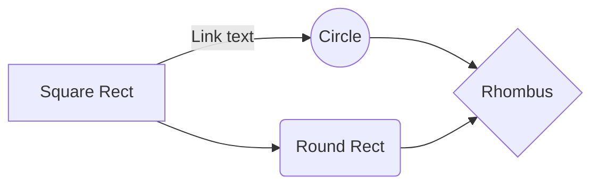
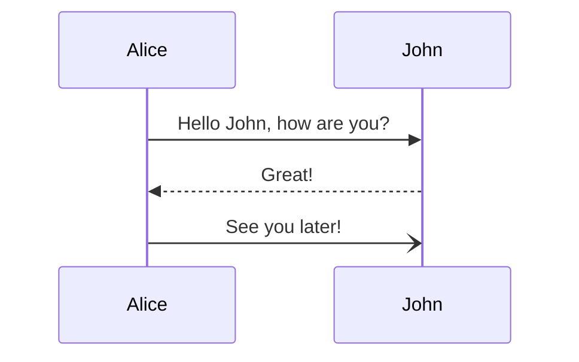
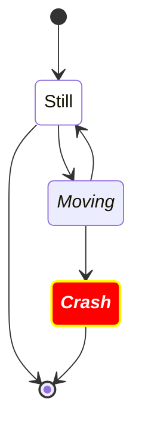

# Подраздел с контентом

Это пример страницы, демонстрирующий, как можно организовывать подразделы. 
Дополнительные сведения о включении подразделов можно найти [здесь](https://diplodoc.com/docs/ru/project/toc).

